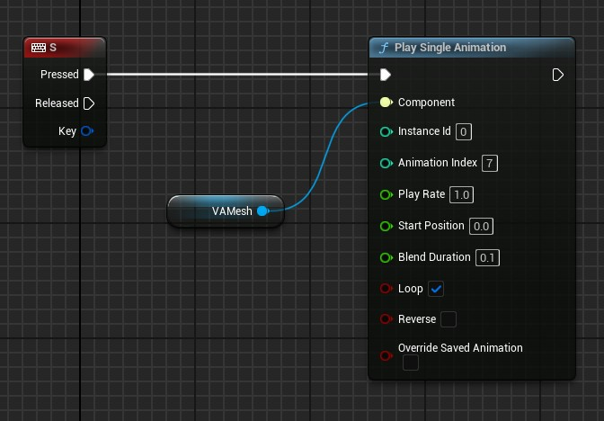
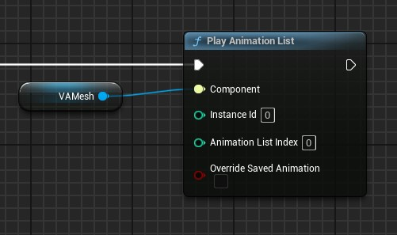
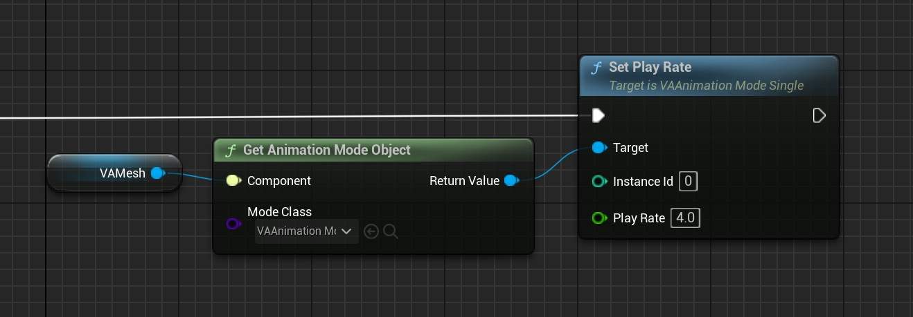
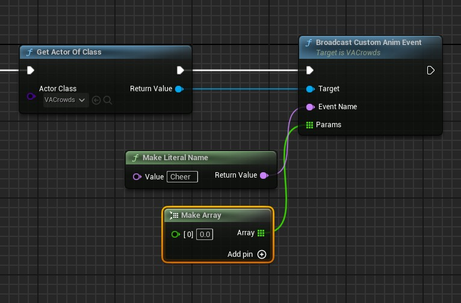
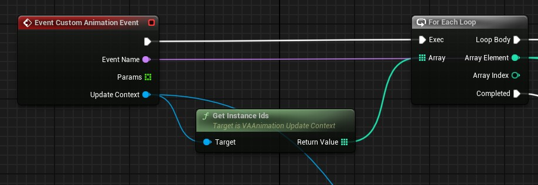

# Animation Control

The Vertex Animation Studio provides helper functions that automatically manage animation modes and provide consistent control whether you're working with single characters or crowds.

## Architecture Overview

> The animation system operates through two distinct modes managed by the Animation Mode Manager:
> 
> - **Single Mode**: Direct control of individual animations
> - **AnimList Mode**: List-based animation sequences

## Single Animation Mode

> Single Mode provides direct, precise control over animations. When you call `PlaySingleAnimation`, the system:
> 
> 1. Automatically switches the instances to Single Mode
> 2. Starts the specified animation immediately
> 3. Maintains this mode until you call a different animation function

{width=600px style="margin-top: 10px; margin-bottom: 5px;"}

> The `PlaySingleAnimation` function accepts:
> 
> - **Animation**: The specific animation from the VA Asset Collection
> - **Instance ID / Instance IDs**: Single instance or array of instances to affect
> - **Play Rate**: Animation speed multiplier
> - **Start Position**: Where to start in the animation (0-1)
> - **Blend Duration**: Time to blend from current animation
> - **Loop**: Whether to loop the animation
> - **Reverse**: Play the animation backwards
> - **Override Saved Animation**: When true, saves this animation state to the level so it persists across editor sessions and plays automatically on level load

### All Available Functions

> Core functions available in Single Mode:
> 
> - `PlaySingleAnimation`: Start a specific animation
> - `StopAnimation`: Stop the current animation
> - `PauseAnimation`: Pause/resume playback
> - `SetAnimationTime`: Jump to a specific point
> - `SetAnimationSpeed`: Adjust playback rate
> - `GetCurrentAnimation`: Query what's playing

## Animation List Mode

> AnimList Mode enables complex animation behaviors through Animation Lists. When you call `PlayAnimationList`, the system:
> 
> 1. Automatically switches the instances to AnimList Mode
> 2. Activates the specified Animation List
> 3. The list's logic takes control of animation playback

{width=600px style="margin-top: 10px; margin-bottom: 5px;"}

> The `PlayAnimationList` function accepts:
> 
> - **Instance ID / Instance IDs**: Single instance or array of instances to affect
> - **Animation List Index**: Which list slot to use in the component (the Animation List object must be pre-configured in the component at this index)
> - **Override Saved Animation**: When true, saves this list assignment to the level so it persists across editor sessions and plays automatically on level load

## Direct Mode Object Access

{width=600px style="margin-top: 10px; margin-bottom: 5px;"}

> For advanced control, you can get the animation mode object directly and call functions on specific instances:

### **Getting Mode Objects**

> Use these functions from the VA Component to access mode objects directly:
>
> - `GetAnimationModeObject` with `VAAnimationMode_Single` class - Returns the Single Mode object for direct function calls
> - `GetAnimationModeObject` with `VAAnimationMode_AnimList` class - Returns the AnimList Mode object for direct function calls
> - `GetAnimationModeObjectForInstance` with an Instance ID - Returns the mode object currently controlling that specific instance

### **Direct Function Calls**

> Once you have a mode object, you can call functions directly on specific instances:

**Single Mode Functions:**
> - `SetPlayRate`: Change animation speed for specific instances
> - `SetPosition`: Jump to specific animation positions  
> - `Pause` / `Resume`: Control playback state per instance
> - `SetReverse`: Change animation direction for instances
> - `StepForward` / `StepBackward`: Frame-by-frame control

**AnimList Mode Functions:**
> - `ChangeInstanceList`: Switch instances to different animation lists
> - `GetInstanceList`: Query which list an instance is currently using
> - `GetInstancesInList`: Get all instances using a specific animation list
> - `GetInstanceListObject`: Get the Animation List object for an instance
> - `GetAnimationListCollection`: Access the collection of available animation lists

This approach provides the most granular control over individual instances and their animation behavior.

## Events and the Crowd System

> The animation system includes a robust event system that's particularly powerful when used with the [Crowd Tools](crowd-tools-editor-mode.md). Events can be broadcast to all instances or specific subsets of your crowd, allowing you to make crowds react dynamically to gameplay events, level changes, or player actions.

### **Broadcasting Events**

> **For Crowd Systems**: Events are broadcast through the AVACrowds parent actor to all crowd instances:

{width=600px style="margin-top: 10px; margin-bottom: 5px;"}

> **For Non-Crowd Systems**: If you're using VA Mesh Component without the crowd tools, you'll need to implement your own event system to communicate with your Animation Lists.

### **Event Handling in Animation Lists**

> Custom Animation Lists receive events by overriding the `CustomAnimationEvent` function. Here's an example:

{width=600px style="margin-top: 10px; margin-bottom: 5px;"}

## See Also

- [Custom Animation Lists](custom-animation-lists.md) - Create custom animation behaviors
- [VA Mesh Component](vertex-anim-mesh-component.md) - Single character setup
- [VA Instanced Mesh Component](vertex-anim-instanced-mesh-component.md) - Crowd setup
- [Crowd Tools](crowd-tools-editor-mode.md) - Placement and management