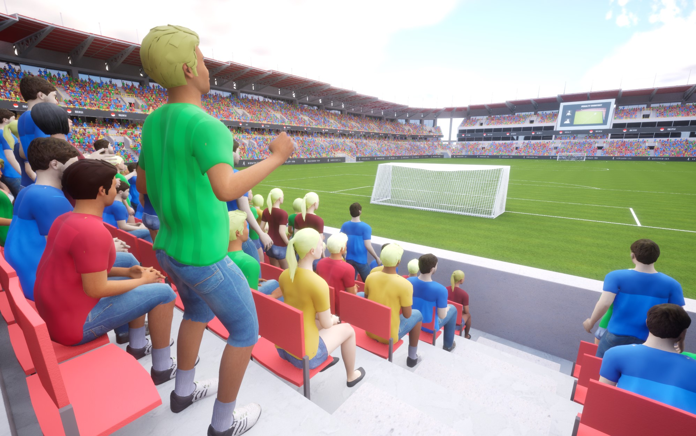
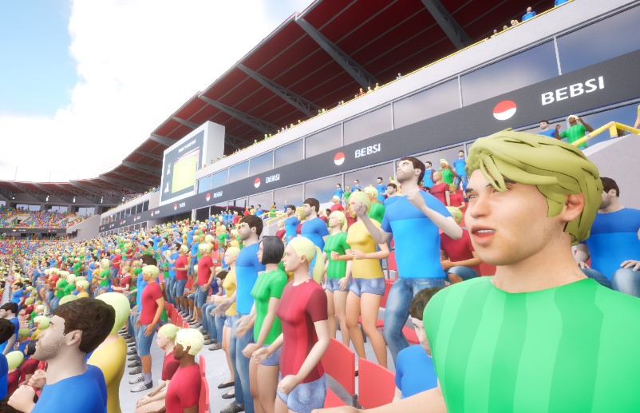

# VA Animation Logic

The Animation Logic system provides a Blueprint-based framework for controlling vertex animation behavior. It allows you to create custom logic classes that define how animations play, transition, and respond to events.

## Overview

Animation Logic classes work with [VA Animation Lists](vertex-anim-lists.md) to control animation playback. Each Animation Logic class defines:

- How animations start and stop
- When and how animations transition
- How animations respond to events
- Custom behavior for specific use cases

## Creating Custom Logic

1. In the Content Browser, right-click and select Blueprint Class
2. Select "VAAnimationListLogic" as the parent class
3. Name your Blueprint (e.g., "BP_IdleWalkLogic")
4. Open the Blueprint and implement the desired behavior using the provided events

{: style="display: block; margin: 0 auto; width: 70%; padding: 10px;"}

## Blueprint Events

### Begin Instances
Called when instances are first registered with the animation system.
```
Event Begin Instances
└── Play Animation
    ├── Instance ID
    ├── Animation Index
    └── Looping = true
```

### End Instances
Called when instances are removed from the animation system.
```
Event End Instances
└── Stop Animation
    └── Instance ID
```

### Update Instances
Called every frame for active instances, allowing for continuous logic.
```
Event Update Instances
└── [Your update logic]
```

### Animation Completed
Called when an animation finishes playing.
```
Event Animation Completed
└── [Handle completion]
```

### Custom Events
Custom events can be defined and triggered for specific animation needs.
```
Event On Custom Animation Event
└── [Handle event]
```

## Common Logic Patterns

### State-Based Logic
Control animations based on character state (idle, walking, running, etc.).

{: style="display: block; margin: 0 auto; width: 70%; padding: 10px;"}

```
Begin Instances
└── Play Idle

Update Instances
├── Get Speed
└── Branch
    ├── Speed > 0
    │   └── Play Walk
    └── Play Idle
```

### Sequential Logic
Play animations in sequence, useful for multi-part animations.
```
Begin Instances
└── Play First Animation

Animation Completed
└── Play Next Animation in Sequence
```

### Random Playback
Randomly select animations from a pool for variety.
```
Begin Instances
└── Play Random Animation

Animation Completed
├── Random Delay
└── Play Next Random Animation
```

### Environmental Logic
Control animations based on environmental factors.
```
Update Instances
├── Get Wind Speed
└── Set Animation Play Rate
```

## Tips & Best Practices

- Keep logic modular and reusable
- Use variables to store state information
- Leverage the instance ID to manage multiple characters
- Consider performance when implementing Update Instances logic
- Use custom events for specialized behavior

## See Also

- [Workflow Overview](workflow-overview.md) - Understand how Animation Logic fits into the overall process
- [VA Animation Lists](vertex-anim-lists.md) - Organize animations using Animation Logic
- [VA Animation Player](va-animation-player.md) - Control animations through the Animation Player
- [VA Mesh Component](vertex-anim-mesh-component.md) - Use Animation Logic with single characters
- [VA Instanced Mesh Component](vertex-anim-instanced-mesh-component.md) - Use Animation Logic with multiple characters
