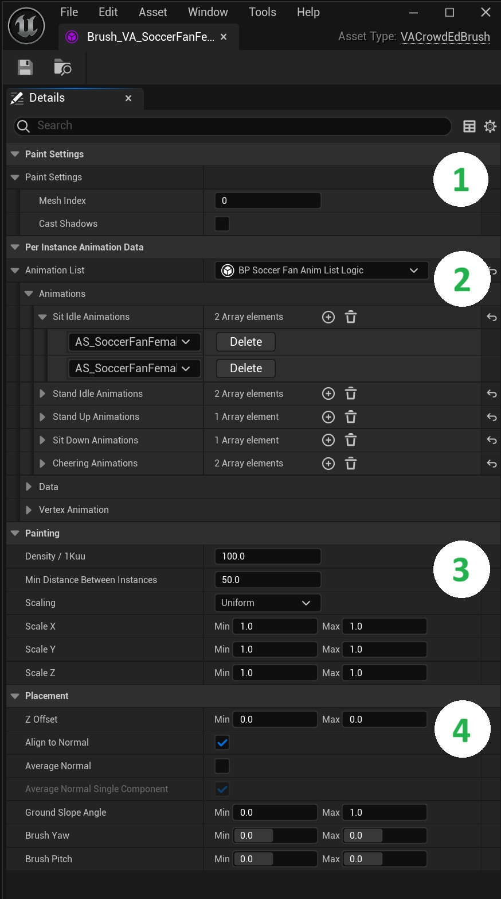
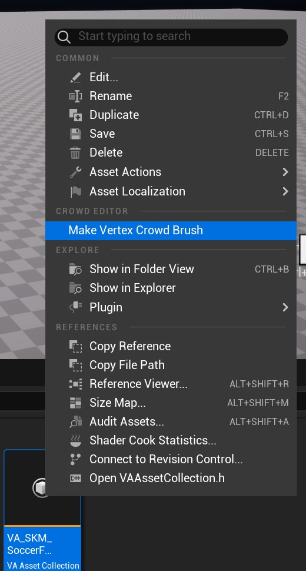

# Crowd Brushes

Tools for controlling how crowd elements are placed and configured in your scene. Brushes define instance properties, animation settings, and placement rules for creating diverse and natural-looking crowds.

{width="60%" style="margin-top: 10px; margin-bottom: 5px;"}

## 1. Paint Settings
> - **Mesh Index selection:** If using Bone Animation types you can select which sub mesh to use here
> - **Shadow casting options:** Toggle shadow casting on the instances when they are placed in the level

## 2. Per Instance Animation Data
> - **Animation List Logic:** Select and edit your Animation Logic settings. For more information see [Animation Logic](animation-logic.md)

## 3. Painting Settings
> - **Density (per 1Kuu):** Controls the number of instances placed within a 10m² area
> - **Min Distance Between Instances:** Sets the minimum spacing required between newly placed instances within the paint brush area
> - **Scaling Mode:** Select from various scaling constraints Uniform, Free and Lock XY/XZ/YZ
> - **Scale (X, Y, Z):** Define minimum and maximum scale values for each axis - instances will be randomly scaled within these bounds

## 4. Placement Settings
> - **Z Offset:** Adjusts the vertical position of instances in the level. Use different Min/Max values to create random height variations
> - **Align to Normal:** Automatically orients instances to match the surface normal direction they are painted on (limited by **Ground Slope Angle**)
> - **Average Normal:** Smooths instance orientation by averaging nearby surface normals on uneven terrain
> - **Average Normal Single Component:** Limits normal averaging to a single component for more controlled orientation
> - **Ground Slope Angle:** Defines the minimum and maximum slope angles where instances can be painted and aligned with normals
> - **Brush Yaw:** Controls instance facing direction. Set different Min/Max values to create random rotations around the vertical axis
> - **Brush Pitch:** Controls forward/backward tilt angle. Set Min/Max bounds to randomize the pitch of placed instances

## Creating Brushes

There are three ways to create a brush asset.

**Direct Addition:**
> - Click "+ Mesh/Brush Asset" in Crowd Editor
> - Select your [VA Asset Collection](va-asset-collection.md)
> - Choose where to save the new brush asset

**Drag and Drop:**
> - Drag [VA Asset Collection](va-asset-collection.md) to "Drop Your Assets Here" area
> - Choose where to save the new brush asset

> {width="70%" style="margin-top: 10px; margin-bottom: 5px;"}

**Right Click Menu:**
> - Right click your [VA Asset Collection](va-asset-collection.md) in the content browser and choose `Make Vertex Crowd Brush`
> - Choose where to save the new brush asset
>
> {width="40%" style="margin-top: 10px; margin-bottom: 5px;"}

## See Also

- [Workflow Overview](workflow-overview.md) - Understand how Crowd Brushes fit into the overall process
- [Crowd Tools Editor Mode](crowd-tools-editor-mode.md) - Main editor interface
- [Paint Tool](crowd-tools-paint.md) - Use brushes with free-form placement
- [Grid Tool](crowd-tools-grid.md) - Use brushes with grid-based placement
- [Single Placement](crowd-tools-single.md) - Use brushes with precise placement
- [VA Asset Collection](va-asset-collection.md) - The asset type used by Crowd Brushes
- [VA Animation Logic](animation-logic.md) - Define custom animation behaviors
