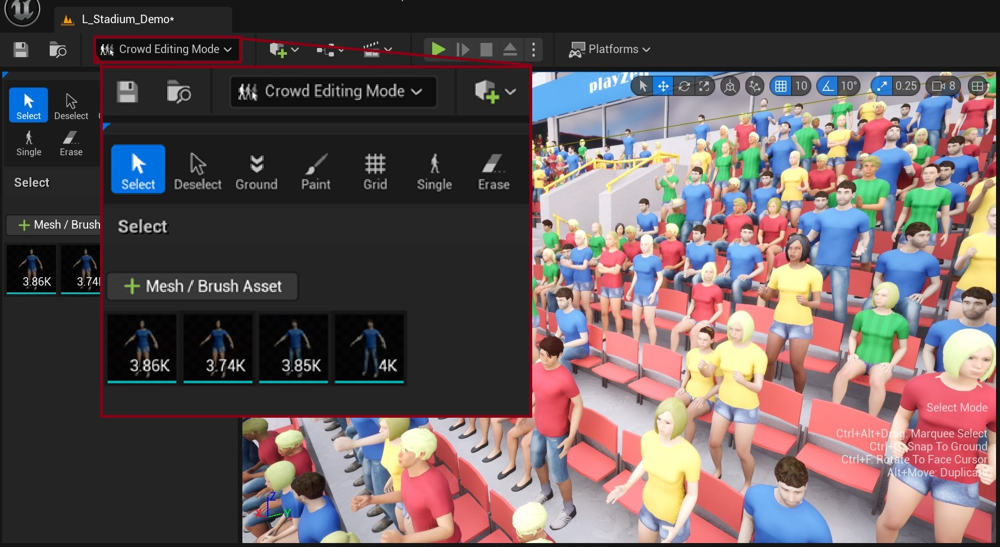
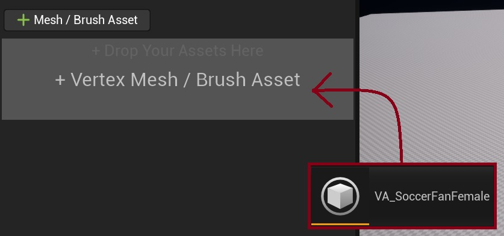
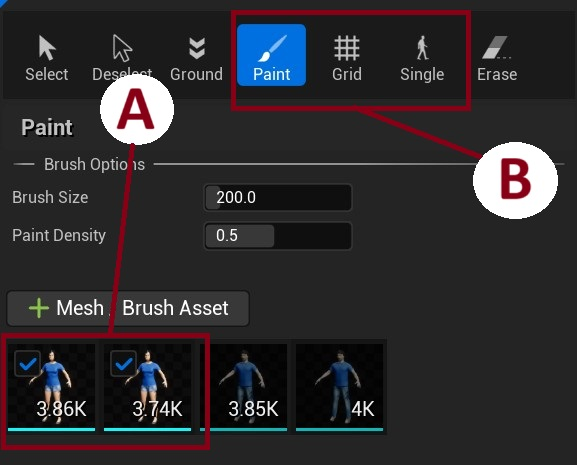

# Crowd Editor Mode

{width="90%" style="margin-top: 10px; margin-bottom: 5px;"}

A specialized editor mode for placing and managing crowd instances in your Unreal Engine level. This mode provides an intuitive interface with various tools for efficient crowd layout creation and management.

### Main Tools
- **Select/Deselect**: Manage instance selection
- **Ground**: Align instances to surfaces
- **Paint**: Paint multiple instances using brush settings
- **Grid**: Place instances in grid patterns
- **Single**: Place individual instances
- **Erase**: Remove instances

**Note:** See [Keyboard Shortcuts](crowd-tools-keyboard-shortcuts.md) for a list of helpful keyboard shortcuts while using each of the crowd tool modes.

### Quick Start Guide

1. Add a [VA Asset Collection](va-asset-collection.md) or [Crowd Brush](crowd-brushes.md) Assets via the '+' button or by drag and dropping assets in the designated area  
{width="60%" style="margin-top: 10px; margin-bottom: 5px;"}

2. Configure brush settings and select them to use with the crowd placement tools
{width="50%" style="margin-top: 10px; margin-bottom: 5px;"}

    1. Select which crowd brushes you would like to use with a placement tool
    2. Select from [Paint](crowd-tools-paint.md), [Grid](crowd-tools-grid.md) or [Single Placement](crowd-tools-single.md) modes

3. Start placing instances into the level using your chosen placement tool

## Read More

- [Crowd Brushes](crowd-brushes.md) - Detailed brush configuration
- [VA Asset Collection](va-asset-collection.md) - Managing animation assets
- [Crowd Tools Shortcuts](crowd-tools-keyboard-shortcuts.md) - List of Keyboard Shortcuts
