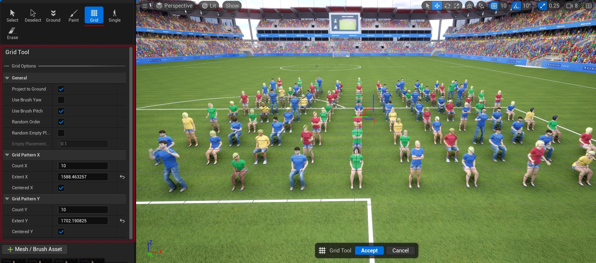

# Grid Tool

The Grid tool enables precise, structured placement of crowd elements in your scene using a configurable grid system.

{ style="margin-top: 10px; margin-bottom: 5px;"}

## Grid Options

### General Settings
- **Project to Ground**: Aligns instances to the surface beneath them
- **Use Brush Hub**: Applies brush settings to placed instances
- **Random Order**: Randomizes the placement sequence of instances
- **Random Empty %**: Sets the percentage of grid cells to leave empty
- **Empty Placement**: Fine-tunes the empty space distribution

### Grid Pattern X
Controls the horizontal grid layout:

- **Count X**: Number of instances along the X-axis
- **Extent X**: Total width of the grid in units
- **Centered X**: Centers the grid horizontally around the placement point

### Grid Pattern Y
Controls the vertical grid layout:

- **Count Y**: Number of instances along the Y-axis
- **Extent Y**: Total depth of the grid in units
- **Centered Y**: Centers the grid vertically around the placement point

## See Also
- [Workflow Overview](workflow-overview.md) - Understand how placement tools fit into the overall process
- [Crowd Tools Editor Mode](crowd-tools-editor-mode.md) - Main editor interface
- [Crowd Brushes](crowd-brushes.md) - Configure brush properties for grid placement
- [Paint Tool](crowd-tools-paint.md) - Alternative free-form placement
- [Single Placement](crowd-tools-single.md) - Alternative precise placement
- [Keyboard Shortcuts](crowd-tools-keyboard-shortcuts.md) - Available shortcuts while using tools
