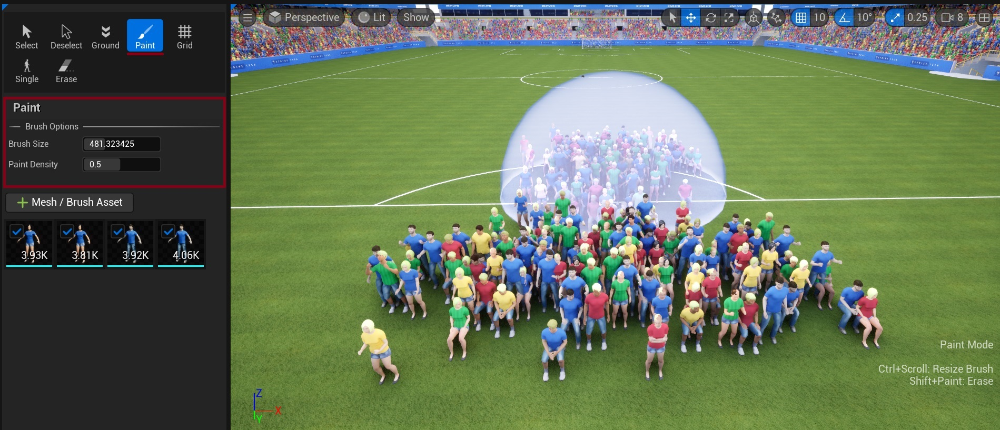

# Paint Tool

The Paint tool provides a free-form placement method for crowd elements in your scene. This intuitive brush-based system allows you to quickly populate areas with crowd members.

{ style="margin-top: 10px; margin-bottom: 5px;"}

## Brush Options
The Paint tool provides two main controls in the Brush Options section:

### Brush Size
- Numerical control for precise brush size adjustment
- Use `Ctrl + Scroll Wheel` to quickly resize the brush
- Larger sizes for broad coverage, smaller for precise placement

### Paint Density
- Percentage control (0-100%) for instance density
- Works with brush's "Density (per 1Kuu)" setting to determine final crowd density

For additional controls while painting, see [Crowd Tools Keyboard Shortcuts](crowd-tools-keyboard-shortcuts.md).

## Mesh/Brush Asset Selection
Below the brush options, you can select from your available crowd brushes. Each brush contains its own:

### Brush Settings
Each brush defines how instances are placed and configured in your scene:

- Instance density and spacing
- Scale ranges and modes
- Surface alignment and height offset
- Rotation and orientation

For detailed configuration options, see [Crowd Brushes](crowd-brushes.md)

## See Also
- [Workflow Overview](workflow-overview.md) - Understand how placement tools fit into the overall process
- [Crowd Tools Editor Mode](crowd-tools-editor-mode.md) - Main editor interface
- [Crowd Brushes](crowd-brushes.md) - Configure brush properties for painting
- [Grid Tool](crowd-tools-grid.md) - Alternative grid-based placement
- [Single Placement](crowd-tools-single.md) - Alternative precise placement
- [Keyboard Shortcuts](crowd-tools-keyboard-shortcuts.md) - Available shortcuts while painting
