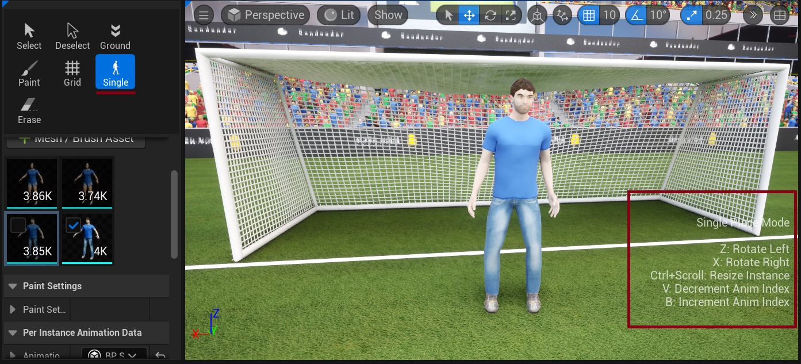

# Single Placement Tool

The Single Placement tool allows for precise, individual placement of crowd elements in your scene with individual control over position and orientation.

{ style="margin-top: 10px; margin-bottom: 5px;"}
## Usage
The Single Placement tool primarily uses keyboard shortcuts for adjusting instances, with a handy shortcut overlay visible in the bottom right of the screen. For a complete list of shortcuts, see [Keyboard Shortcuts](crowd-tools-keyboard-shortcuts.md).

### Basic Controls
- **Mouse Placement**: Click to place an instance at the cursor location
- **Rotation**: 
    - Use `Z` and `X` keys to rotate left and right respectively
    - Hold left mouse button and drag to rotate the instance. Release to place with the current rotation
- **Size Adjustment**: Use `Ctrl + Scroll Wheel` to resize the instance
- **Animation Control**: Use `V` and `B` keys to preview different animations

### Placement Settings
Instance placement is affected by the selected crowd brush's placement settings, including:

- Surface alignment
- Height offset
- Rotation constraints
- Other placement rules

For detailed brush configuration options, see [Crowd Brushes](crowd-brushes.md).

## Read More
- [Troubleshooting](troubleshooting.md) - Find solutions for common problems and links to contact support
- [Crowd Brushes](crowd-brushes.md) - Brush configuration options
- [Keyboard Shortcuts](crowd-tools-keyboard-shortcuts.md) - Complete list of available shortcuts

