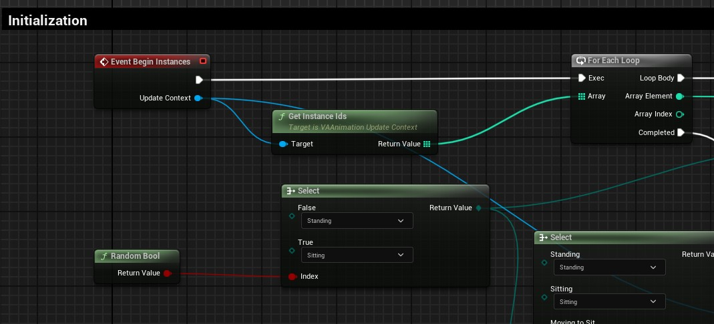
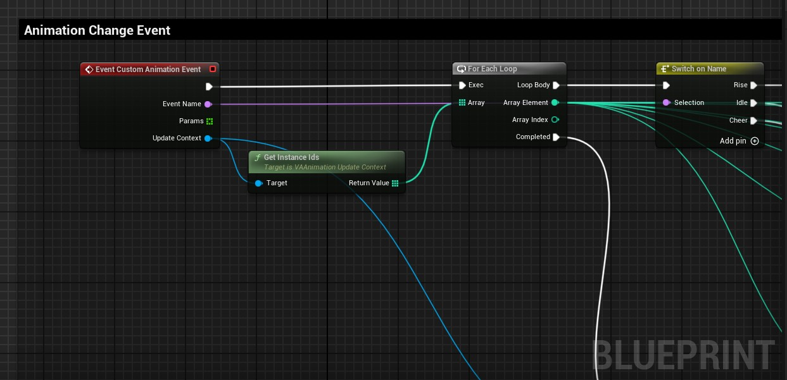
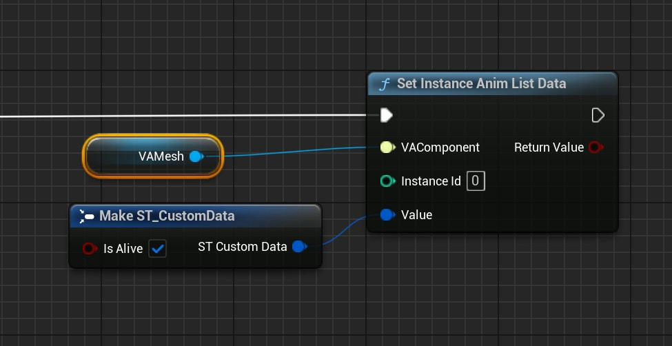
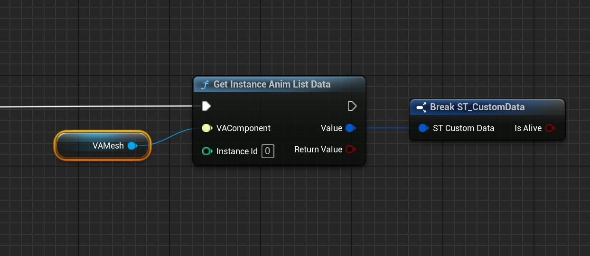

# Custom Animation Lists

Animation Lists allow you to create reusable animation behaviors that can be applied to any number of instances. By creating custom Animation List blueprints, you can define complex logic for how animations play, transition, and respond to events.

## Creating a Custom Animation List

> To create a custom Animation List:
> 
> 1. Create a new Blueprint class
> 2. Select `VAAnimationList` as the parent class
> 3. Name your blueprint (e.g., `BP_SoccerFanAnimListLogic`)
> 4. Open the blueprint and override the events you need

{width=600px style="margin-top: 10px; margin-bottom: 5px;"}

### **Event Begin Instances**
> Called when instances are assigned to use this Animation List. Use this to initialize any custom logic or state.

### **Event End Instances**  
> Called when instances stop using this Animation List. Use this for cleanup.

### **Event Update Instances**
> Called every frame for all active instances. Use this for time-based logic or checking transition conditions.

### **Event Animation Completed**
> Called when an animation finishes playing. Use this to choose the next animation or transition to a different behavior.

### **Event Custom Animation Event**
> Called when events are broadcast from the AVACrowds actor or your custom event system. Use this to respond to gameplay events.

> **Update Context**: All events receive an Update Context parameter that provides functions to control animations (play, pause, set position, etc.) and query current animation state (which animation is playing, current position, play rate, etc.) for any instance.

{width=600px style="margin-top: 10px; margin-bottom: 5px;"}

## Working with the Update Context

> The Update Context is your primary tool for controlling animations from within your Animation List logic. It provides:

### **Animation Control Functions**
> - `PlayAnimation`: Start a new animation for specific instances
> - `PauseAnimation` / `ResumeAnimation`: Pause and resume playback
> - `SetAnimationPosition`: Jump to a specific point in the animation
> - `SetAnimationPlayRate`: Change animation speed
> - `SetAnimationLooping`: Enable/disable looping
> - `StopAnimation`: Stop the current animation

### **Query Functions**
> - `GetInstanceIds`: Get all instances using this list
> - `GetAnimation`: Get which animation is currently playing
> - `GetPosition`: Get current position in the animation (0-1)
> - `GetPlayRate`: Get current playback speed
> - `GetPlaying`: Check if animation is playing
> - `GetLooping`: Check if animation is looping

**Example**: For a detailed implementation example, see `Plugins/VertexAnimation/Content/DemoMap/Blueprints/SoccerGame/BP_SoccerFanAnimListLogic.uasset`

## Instance Data System

> Animation Lists can store custom data per instance, allowing each instance to maintain its own state and behavior parameters:

### **Custom Struct Data**
> Create custom struct types to store per-instance data that your Animation List logic can use:
>
> - **State Information**: Current behavior state, timers, counters
> - **Randomization Data**: Random seeds, variation parameters
> - **Logic Parameters**: Custom thresholds, triggers, or conditions
> - **Behavior Memory**: Previous actions, history, or context

### **Instance Data Functions**
> Use these helper functions to manage per-instance data:
>
> - `SetInstanceAnimListData`: Store custom struct data for a specific instance
> - `GetInstanceAnimListData`: Retrieve custom struct data from an instance  
> - `ClearInstanceAnimListData`: Remove stored data from an instance

{width=600px style="margin-top: 10px; margin-bottom: 5px;"}

{width=600px style="margin-top: 10px; margin-bottom: 5px;"}

This system enables complex per-instance behaviors like state machines, conditional logic, and persistent animation behaviors that vary between instances.

## Built-in Animation List Types

> The plugin includes pre-built Animation List types you can use or extend:

### **Sequence List**
> Plays animations in the order they appear in the list. When the last animation completes, it loops back to the first.

### **Random List**  
> Randomly selects animations from the list. You can configure weights and prevent the same animation from playing twice in a row.

## See Also

- [Animation Control](animation-control.md) - Overview of the animation system and modes
- [VA Mesh Component](vertex-anim-mesh-component.md) - Single character setup
- [VA Instanced Mesh Component](vertex-anim-instanced-mesh-component.md) - Crowd setup
- [Crowd Tools](crowd-tools-editor-mode.md) - Placement and management tools