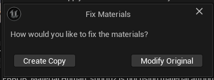

# Getting Started

This guide shows you how to convert skeletal mesh animations to vertex animations and implement them in your project.

## Workflow Overview

## Step 1: Create VA Asset

> 1. Right-click your skeletal mesh in Content Browser
> 2. Choose animation type:
>     - **Make Bone Animation**: While this method enables animation sharing between multiple meshes and accommodates more animations and vertices than Vertex Animation, it is not as performant. Best for memory-flexible projects where you need to share animations across different characters.
>     - **Make Vertex Animation**: This method is more performant with lower material costs but requires larger textures. Animations are unique per mesh and cannot be shared. Best for maximum FPS in crowd scenes.
> 3. Select animations to include in your VA Asset Collection
> 4. Click "Create Asset" and choose save location

{style="margin-top: 10px; margin-bottom: 5px;"}

### What is a VA Asset Collection?

> A VA Asset Collection is the core asset that stores all data required for vertex animations. Learn more about what it contains in the [VA Asset Collection](va-asset-collection.md) documentation.

## Step 2: Fix Materials

> Since vertex animations work differently than skeletal animations, your materials need to be modified. A dialog will appear showing any material errors:

{style="margin-top: 10px; margin-bottom: 5px;"}

> When resolving material errors, you'll have two options:
> 
> - **Create Copy**: Creates duplicates of your materials before making changes (recommended to preserve originals)
> - **Modify Original**: Directly modifies your existing materials

{style="margin-top: 10px; margin-bottom: 5px;"}

> After completing these steps, you'll have a new VA Asset Collection in your content browser:

{style="margin-top: 10px; margin-bottom: 5px;"}

## Step 3: Configure Asset (Optional)

> Double-click your VA Asset Collection to open the editor and adjust settings:
> 
> - **Animation Settings**: Frame rates, compression, optimization - [Learn more](va-asset-editor-animation.md)
> - **Mesh Settings**: LODs, vertex limits, texture sizes - [Learn more](va-asset-editor-mesh.md)
> - **Custom Data**: Per-instance variations like color tints - [Learn more](va-asset-editor-custom-data.md)
> 
> Click "Rebuild Asset" after making changes to apply them.

## Step 4: Choose Implementation

### Single Character
> Use [VA Mesh Component](vertex-anim-mesh-component.md) for individual characters needing precise control

### Multiple Characters  
> Use [VA Instanced Mesh Component](vertex-anim-instanced-mesh-component.md) for crowds and multiple characters

## Step 5: Place Characters (Multiple Characters Only)

> Use [Crowd Tools](crowd-tools-editor-mode.md) for easy placement:
> 
> - **Paint Tool**: Free-form brush placement
> - **Grid Tool**: Structured grid placement  
> - **Single Tool**: Precise individual placement

{: style="display: block; margin: 0 auto; width: 85%; padding: 10px;"}

## Step 6: Control Animations

> Configure animations through:
> 
> - [Animation Control](animation-control.md): Control animations with Single and AnimList modes
> - [Custom Animation Lists](custom-animation-lists.md): Create custom animation behaviors
> - [Sequencer Integration](sequencer-integration.md): Cinematic control

## Next Steps

> - [VA Asset Collection](va-asset-collection.md): Manage your animation assets
> - [VA Asset Collection](va-asset-collection.md): Fine-tune asset settings
> - [Troubleshooting](troubleshooting.md): Solve common issues