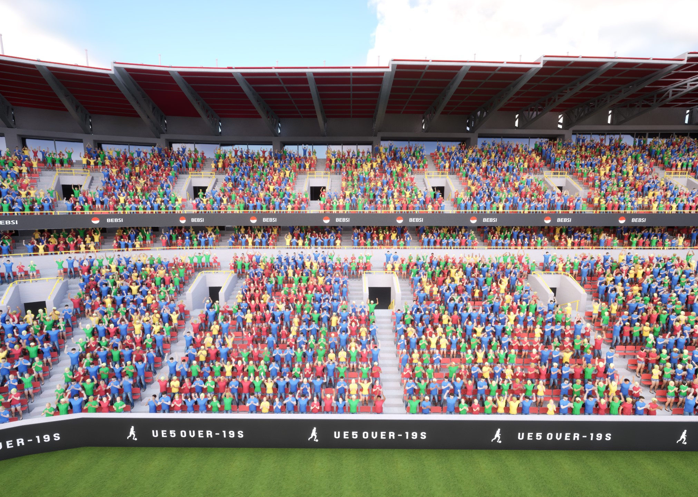
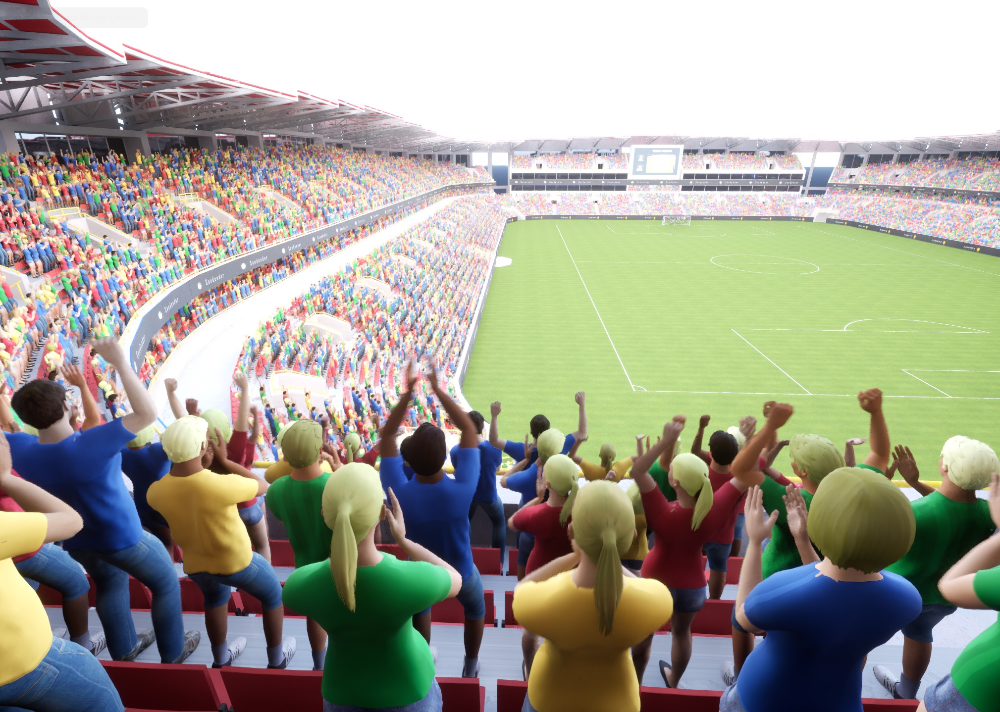
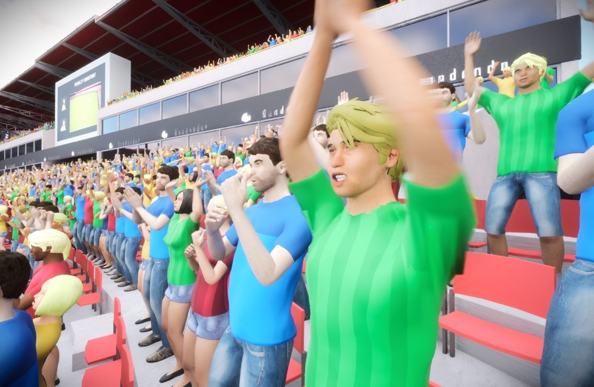

# Vertex Animation Toolset for UE5

The Vertex Animation Toolset converts Skeletal Mesh characters into Vertex Animation-based Static Meshes, significantly improving performance when rendering multiple animated characters.

> **Important**: This plugin requires Unreal Engine 5.4 or above.

{: style="display: block; margin: 0 auto; width: 85%; padding: 10px;"}

## Overview

This plugin addresses performance bottlenecks in scenes with multiple animated characters by converting skeletal animations to vertex animations. The conversion process preserves animation quality while reducing CPU overhead and enabling efficient GPU-based rendering through mesh instancing.

## Core Features

### Main Components
1. [**Vertex Anim Mesh Component**:](vertex-anim-mesh-component.md) For single-character implementations requiring individual control
2. [**Vertex Anim Instanced Mesh Component**:](vertex-anim-instanced-mesh-component.md) For efficient rendering of multiple characters
3. [**VA Anim Player**:](va-animation-player.md) For animation control and playback of individual instances
4. [**VA Asset Collection**:](va-asset-collection.md) Manages and stores all data required for vertex animations.  It serves as a container holding meshes, animations, and associated data
5. [**Crowd Tools Editor Mode**:](crowd-tools-editor-mode.md) For visual management and configuration of character groups

### Vertex Animations
- **Animation Types**: Choose between bone animations (enables sharing between meshes, ideal for memory-flexible projects) and vertex animations (reduces material costs, requires more texture memory, unique per mesh)
- **Blueprint Integration**: Program animation behavior using Blueprint-based control systems

### Workflow Integration
- Direct conversion from existing skeletal animations
- Automatic material system integration
- Built-in crowd management tools
- Multiple character placement methods

## Use Cases

{: style="display: block; margin: 0 auto; width: 85%; padding: 10px;"}

The plugin is most effective for:

- Dense urban environments with background NPCs
- Large-scale battle sequences
- Games requiring numerous background characters
- Performance-critical scenes with multiple animations

## Technical Overview

### Performance
- Eliminates per-frame skeletal computation overhead
- Uses GPU-efficient instanced rendering
- Optimizes memory usage through shared resources
- Scales effectively with large numbers of characters

### Development
- Compatible with UE 5.4 and above
- Flexible animation management
- Integrated editor toolset

{: style="display: block; margin: 0 auto; width: 85%; padding: 10px;"}

## To Get Started

- Check out the [Quick Start Guide](quick-start.md) to begin implementing the Vertex Animation Toolset in your project.
