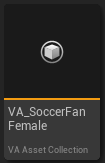

# Quick Start Guide

## Initial Setup

## 1. Choose Your Animation Type
> Right-click on your skeletal mesh and choose between two options:
>
>   - **Make Bone Animation**  
>     While this method enables animation sharing and accommodates more animations and vertices than Vertex Animation, it is not as performant. For maximum FPS in crowd animations, consider using Vertex Animation instead.
>
>   - **Make Vertex Animation**  
>    This method is more performant and requires larger textures but has lower material costs. However, it doesn't support animation sharing, meaning multiple meshes cannot use the same animation asset.
>
>*Which should you choose?*
>
>Consider these trade-offs:
>
>   - **Bone Animation:** Best for sharing animations across multiple meshes or when using many animations  
>   - **Vertex Animation:** Best for performance and lower material costs

## 2. Select Animations
> After choosing your animation type, you'll see a window displaying all compatible animations for your mesh. Select the animations you want to include in your [VA Asset Collection](va-asset-collection.md).
>
>   {style="margin-top: 10px; margin-bottom: 5px;"}
>
>   - Use "Select All" or "Deselect All" to quickly manage your selection  
>   - Individual animations can be toggled using the checkboxes  
>   - Click "Create Asset" when you're satisfied with your selection

## 3. Save Your Asset
> Choose a location in your content browser to save the new [VA Asset Collection](va-asset-collection.md).

## 4. Material Adjustment
> Since this is a Vertex Animation system, your materials will need to be modified. A window will appear showing any material errors that need to be resolved.
>
>   {style="margin-top: 10px; margin-bottom: 5px;"}

## 5. Resolve Material Issues
> When resolving material errors, you'll have two options:
>
>   {style="margin-top: 10px; margin-bottom: 5px;"}
>
>   - **Create Copy**  
>     Creates duplicates of your materials before making the necessary changes (recommended to preserve originals)
>   
>   - **Modify Original**  
>     Directly modifies your existing materials

## 6. Final Result
>After completing these steps, you'll have a new [VA Asset Collection](va-asset-collection.md) in your content browser.
>
>   {style="margin-top: 10px; margin-bottom: 5px;"}

## 7. Using Your VA Asset Collection

>After creating your [VA Asset Collection](va-asset-collection.md), you have three options for using it in your project:
>
>- **In the Crowd Tools Editor Mode**  
>  Use this mode for easy placement of crowd characters with an intuitive editor interface.
>
>- **In a Vertex Anim Mesh Component**  
>  Perfect for adding vertex animation to a single actor in your scene.
>
>- **In a Vertex Anim Instanced Mesh Component**  
>  Ideal for efficiently rendering multiple instances of the same vertex-animated mesh.

## Next Steps

Now that you've created your first VA Asset Collection, you can:

- **Understand the complete workflow**: Check out the [Workflow Overview](workflow-overview.md) to see how all components work together
- **Choose your implementation path**:
  - For single characters: [Use the VA Mesh Component](vertex-anim-mesh-component.md)
  - For multiple characters/crowds: [Implement VA Instanced Mesh Components](vertex-anim-instanced-mesh-component.md)
  - For visual crowd management: [Learn about Crowd Tools Editor Mode](crowd-tools-editor-mode.md)
- **Learn about animation control**: Explore the [VA Animation Player](va-animation-player.md) documentation
