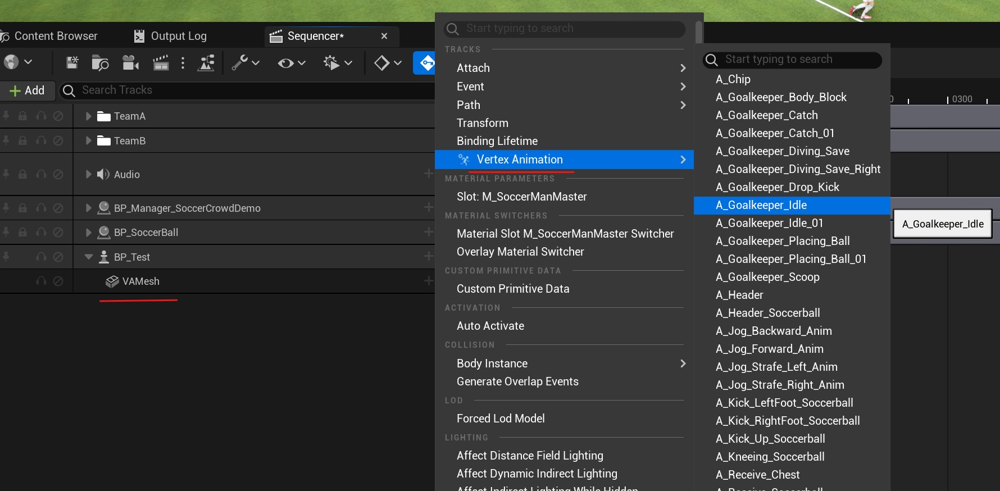
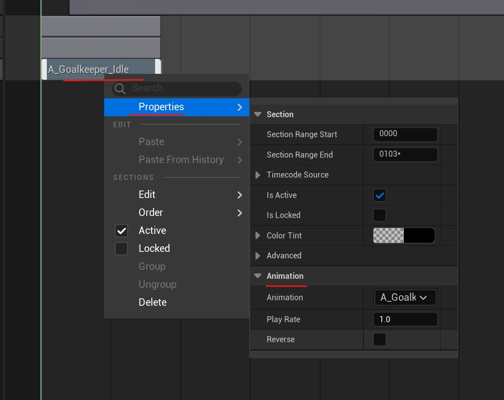
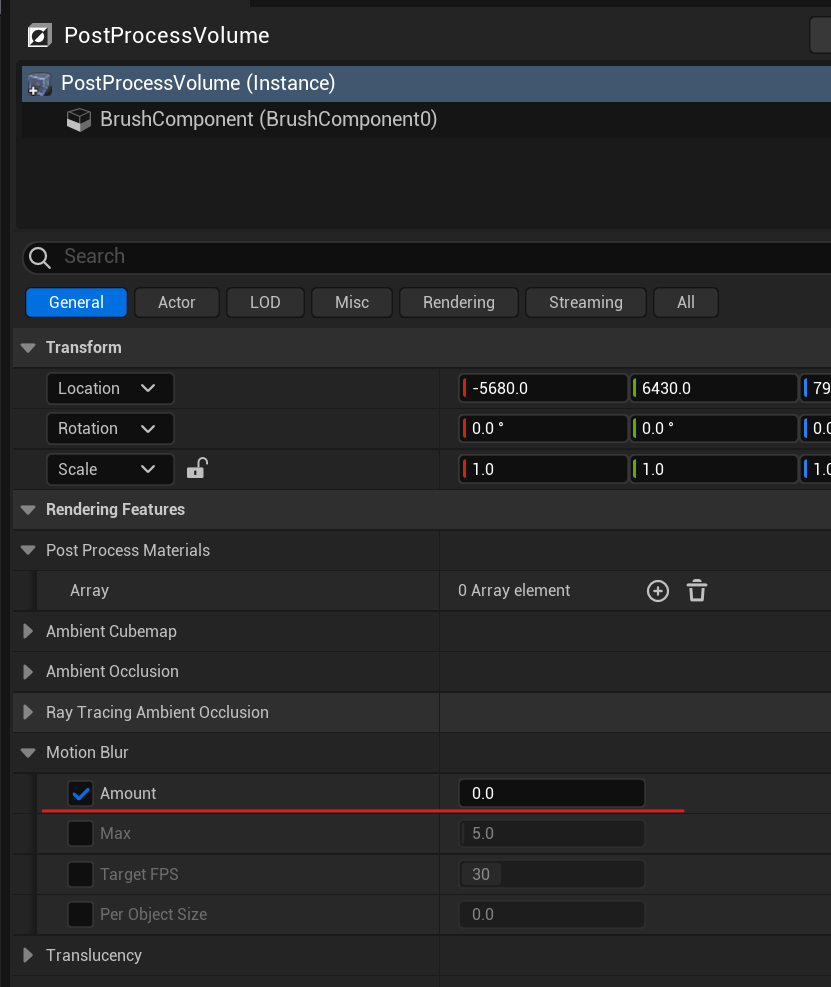

# Sequencer Integration (WIP)

The Vertex Animation Studio integrates with Unreal Engine's Sequencer for cinematic control of vertex animations.

## How to Use VA Animations in Sequencer

### **Step 1: Create a Blueprint Actor**
> 1. Create a new Blueprint Actor
> 2. Add a **VA Mesh Component** to your Blueprint
> 3. Configure the VA Mesh Component with your VA Asset Collection
> 4. Save the Blueprint

### **Step 2: Add to Sequencer**
> 1. Open your Level Sequence in Sequencer
> 2. Drag your Blueprint Actor into the level (if not already placed)
> 3. Click the **"+ Track"** button in Sequencer
> 4. Select your Blueprint Actor from the list

### **Step 3: Add VA Animation Track**
> 1. In the Sequencer timeline, find your Blueprint Actor
> 2. Right-click on the VA Mesh Component
> 3. Select **"VA Animation Track"** from the context menu
> 4. Select the first animation to add the track

{: style="display: block; margin: 0 auto; width: 85%; padding: 10px;"}

### **Step 4: Add Animations**
> 1. Right-click on the VA Animation Track
> 2. Select **"Add Animation Section"**
> 3. Choose an animation from your VA Asset Collection
> 4. The animation section appears on the timeline

### **Step 5: Configure Animation Properties**
> 1. Right-click on the animation span in the track to open properties
> 2. In the properties popup, you can adjust:
   > - **Animation**: Choose which animation to play
   > - **Play Rate**: Speed of playback (1.0 = normal)
   > - **Reverse**: Play animation backwards
> 3. Drag the edges of the animation span to adjust duration
> 4. Move the span along the timeline to change when it plays

{: style="display: block; margin: 0 auto; width: 85%; padding: 10px;"}

## Tips

> - Animations must exist in the VA Asset Collection assigned to your component
> - Use consistent frame rates between your animations and Sequencer project
> - If you see jumpiness in playback, disable motion blur in your Post Process Volume by setting Motion Blur Amount to 0

{: style="display: block; margin: 0 auto; width: 85%; padding: 10px;"}

---

> **Note:** Sequencer integration is currently experimental and work-in-progress. Some features may be limited or subject to change in future updates.

## See Also

- [VA Mesh Component](vertex-anim-mesh-component.md) - Component setup
- [VA Asset Collection](va-asset-collection.md) - Managing animations
- [Getting Started](getting-started.md) - Getting started with the plugin