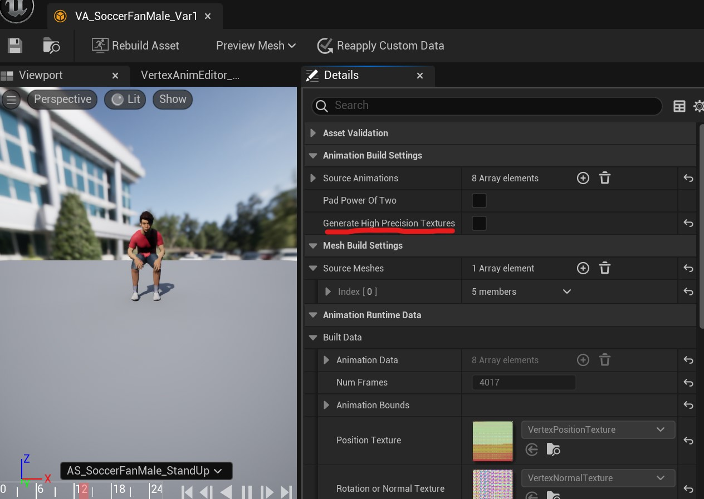
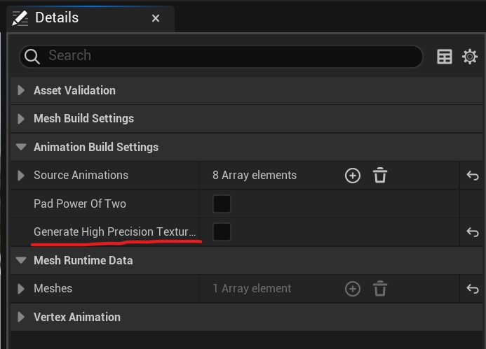

# Troubleshooting

This guide helps you diagnose and resolve common issues you might encounter while using the VAT Toolset Plugin.

??? "Why are my animations playing slow?"
    

    This is usually related to the animation sequence frame rate. To fix:

    1. Go to Import Settings
    2. Open the Advanced section
    3. Enable "Set Default Sample Rate"
    4. Click the "Reimport Animation" button at the top
    5. Open your [VA Asset Collection](va-asset-collection.md) and press the Rebuild button
    

??? "Should I use translucent materials with my vertex animated meshes?"
    

    For non-Nanite meshes, translucent materials can be used but may impact performance. However, when using Nanite, you must use masked materials instead of translucent. Be aware that masked materials can potentially create holes in your mesh when using the Nanite setting.
    

??? "Why does my mesh look low quality or broken when enabling Nanite support?"
    

    If your mesh appears broken or low quality with Nanite enabled, it's likely using the fallback mesh instead of Nanite. This typically happens when:

    1. Materials are set to translucent (use masked materials instead)
    2. After switching to masked materials, rebuild your [VA Asset Collection](va-asset-collection.md)
    

??? "Error Creating Vertex Animation: Required texture dimension exceeds maximum."
    

    { style="margin-top: 10px; margin-bottom: 5px;"}

    This error occurs when the combined size of vertex count and animation frames exceeds the system's limits. The total size is calculated by multiplying the number of vertices by the number of animation frames and then taking the square root of the result. The data will need to be written to a texture with these dimensions. The texture dimensions cannot exceed 8192 by 8192. To resolve:

    1. Reduce your character's vertex count. You can decimate vertices in blender or you can use Unreal's reduction settings, found in the Skeletal Mesh editor window:
    { style="margin-top: 10px; margin-bottom: 5px;"}
    2. Reduce the number of animation frames
    { style="margin-top: 10px; margin-bottom: 5px;"}
    3. Consider using a lower-poly version of your mesh for background characters or switch to bone mode when [creating your assets](getting-started.md).
    

??? "VA Asset Collection file size is too large."
    

    You can reduce the file size of your asset by unticking precision textures in the animation build settings.

    1. Open the VA Asset Collection and untick Generate High Precision Textures:
    { style="margin-top: 10px; margin-bottom: 5px;"}
    2. Select "Rebuild Asset" at the top of the editor window.

    

??? "Ripple or wavy appearing animations."
    

    When "Generate High Precision Textures" is disabled on your VA Asset Collection, animations may display rippling or wave-like artifacts. This occurs because fewer vertex positions are recorded per vertex, reducing animation texture storage requirements.
    This lower precision setting is suitable for background crowd instances that remain distant from the camera. However, for crowd elements that will appear closer to the camera, consider either:

    - Enabling the "Generate High Precision Textures" option, or
    - Selecting "Bone Animation" mode when creating your VA Asset Collection

    **Important:** Don't forget to press Rebuild Asset when adjusting settings on the VA Asset Collection

    { style="margin-top: 10px; margin-bottom: 5px; max-width: 300px;"}

    

## Best Practices

- For Nanite meshes, use masked materials instead of translucent. Ideally, design character models to avoid requiring masked materials altogether
- Keep vertex counts optimized for your target platform
- Check animation frame rates during import

## See Also

- [Getting Started](getting-started.md) - Step-by-step guide to getting started
- [VA Asset Collection](va-asset-collection.md) - Asset management and configuration
- [Animation Control](animation-control.md) - Animation control and playback
- [Custom Animation Lists](custom-animation-lists.md) - Animation system details
- [Crowd Tools Editor Mode](crowd-tools-editor-mode.md) - Editor interface overview

## Getting Help
We also offer direct support through our [Discord community](https://discord.gg/PFhpMCCAtc), where you can get help from both the developers and other users.
