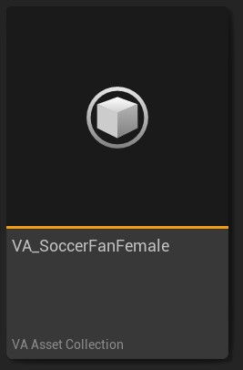
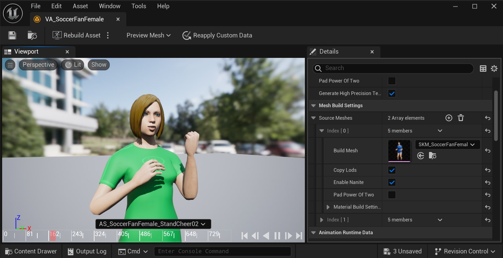

# UVAAssetCollection

The VA Asset Collection is the core asset type in the Vertex Animation Toolset that manages and stores all data required for vertex animations. It serves as a container that holds meshes, animations, and their associated data.

{width="20%" style="margin-top: 10px;"}

For step-by-step instructions on creating a VA Asset Collection, see our [Quick Start Guide](quick-start.md). To understand how VA Asset Collections fit into the overall workflow, check out the [Workflow Overview](workflow-overview.md).

## Overview

A VA Asset Collection contains:

- Source skeletal meshes and their build settings
- Built vertex animation meshes
- Animation data stored in textures
- Material configurations
- Per-mesh custom data

## Components

### Mesh Data
- Stores converted static meshes optimized for vertex animation
- Maintains UV channel information
- Contains bone data for skeletal mesh animations
- Tracks vertex counts and bounds
- Stores material configurations and overrides

### Animation Data
- Position and rotation/normal texture data
- Animation frame data
- Animation bounds
- Frame rates and timing information
- Animation sequence metadata

### Material Settings
- Source material references
- Material build configurations
- Material parameter mappings
- Custom material data per mesh

## Editor Features

A custom editor window is available for working with VA Asset Collections. See the [VA Asset Editor](va-asset-editor.md) page for more information.

{width="70%" style="margin-top: 10px;"}

## Technical Details

### Storage Format
- Animations are stored as texture-based vertex data
- Positions and rotations/normals are split into separate textures
- Each mesh maintains its own vertex layout and UV configuration
- Build hashes track asset changes and dependencies

### Performance Considerations
- Optimized for runtime texture sampling
- Efficient memory usage through texture-based storage
- Minimal runtime overhead
- Built data is preprocessed for optimal playback

## See Also

- [Quick Start Guide](quick-start.md) - How to create and configure VA Asset Collections
- [VA Asset Editor](va-asset-editor.md) - Edit existing VA Asset Collections
- [Workflow Overview](workflow-overview.md) - Understand how VA Asset Collections fit into the overall process
- [VA Animation Player](va-animation-player.md) - Control animations in your VA Asset Collection
- [VA Mesh Component](vertex-anim-mesh-component.md) - Use VA Asset Collections with single characters
- [VA Instanced Mesh Component](vertex-anim-instanced-mesh-component.md) - Use VA Asset Collections with multiple characters
