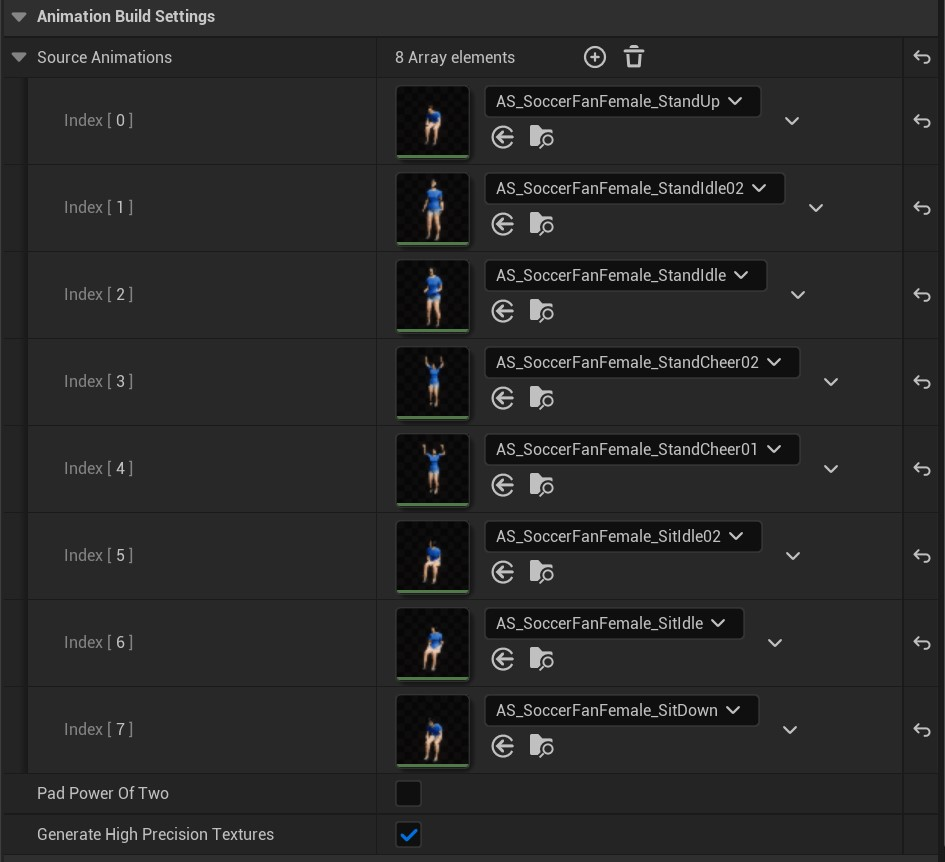
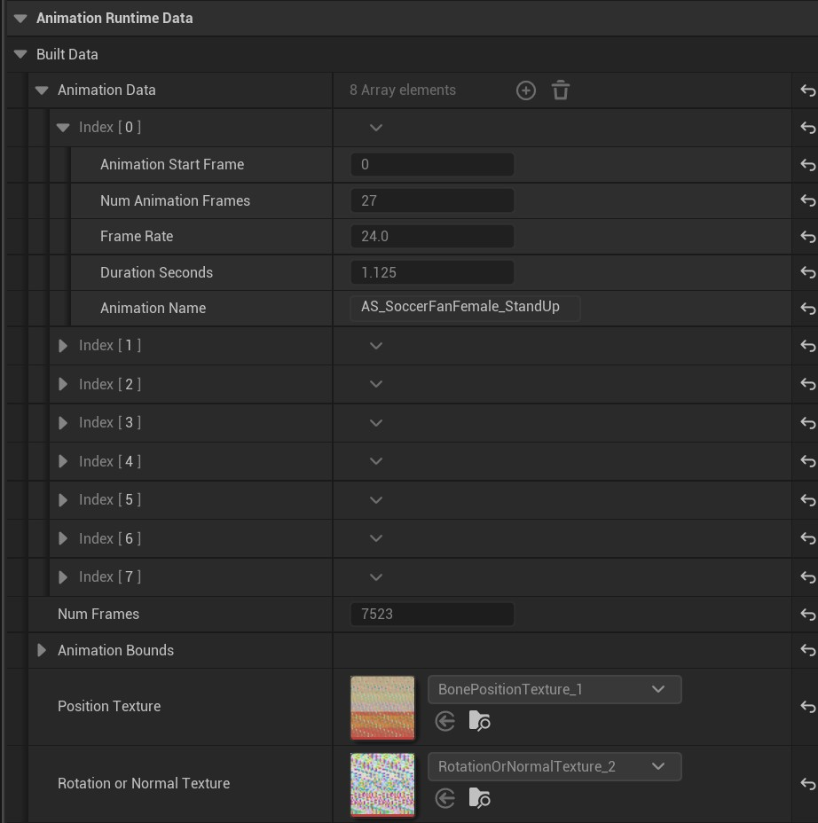

# VA Asset Editor - Animation Settings

This page details the animation-related settings in the VA Asset Editor, covering both build configuration and runtime data.

## Animation Build Settings
{width=600px style="margin-top: 10px; margin-bottom: 5px;"}

The Animation Build Settings panel lets you manage your animation sequences and build options. Here you can edit the source animation list. Additional settings include options for texture generation quality and power-of-two padding optimization.

**Note:** Remember to click the Rebuild Asset button after making changes.

## Animation Runtime Data
{width=600px style="margin-top: 10px; margin-bottom: 5px;"}

This section shows the read-only compiled animation data for each sequence, including:

> - Animation frame details (start frame, duration, frame rate)
> - Total frame count
> - Animation Bounds
> - Position and rotation/normal texture mappings

## Animation Preview

The timeline area in the VA Asset Editor displays your currently selected preview animation. You can switch between different animations to visualize how your asset will appear in-game.

## Animation Timeline

The bottom panel provides standard timeline controls for previewing your animations. Use these controls to play, pause, and scrub through your animation sequences.

## See Also

- [VA Asset Editor](va-asset-editor.md) - Main editor overview
- [VA Editor - Mesh Settings](va-asset-editor-mesh.md) - Configure mesh-related settings
- [VA Editor - Custom Data](va-asset-editor-custom-data.md) - Configure per-instance custom data
- [VA Animation Player](va-animation-player.md) - Control animations in your VA Asset Collection
- [VA Animation Lists](vertex-anim-lists.md) - Organize animations for playback
