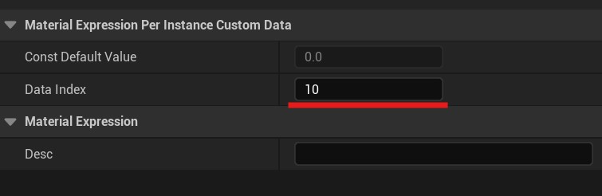
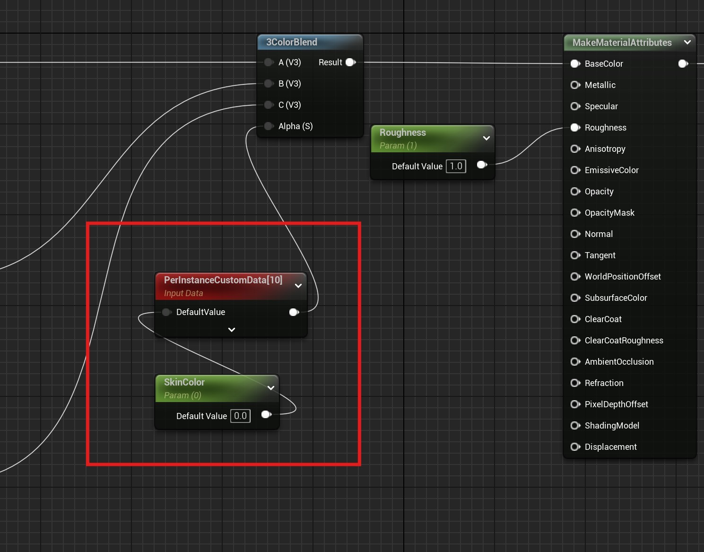
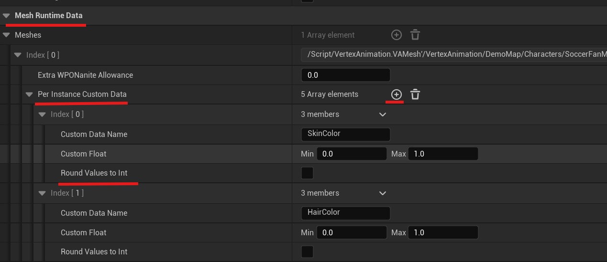
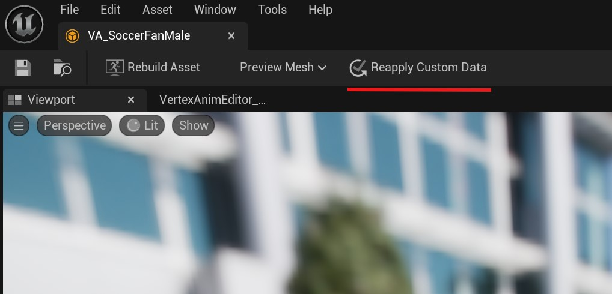

# Custom Data - Instance Variations

This page details the custom data settings in the VA Asset Editor, which allow you to create variations between instances of your vertex animated meshes.

## Per Instance Custom Data

The Per Instance Custom Data system allows you to inject randomized or controlled float values into your instanced materials. This creates visual diversity across instances without the need for multiple materials or meshes. Each custom data entry consists of:

> - **Custom Data Name**: A unique identifier used to reference this parameter in your materials
> - **Custom Float Range**: Minimum and maximum values for the parameter
> - **Round Values to Int**: Option to round the generated values to whole numbers

{width=600px style="margin-top: 10px; margin-bottom: 5px;"}

## Setup

To set up your custom data, follow these steps:

### Step 1: Add Per Instance Custom Data Node
> In your material, add a Per Instance Custom Data node

### Step 2: Set Data Index
> When creating your first Custom Data node, assign it a Data Index of 10. Indices **0-9 are reserved for system functionality so do not use these indices. Instead start at 10**. For each additional Custom Data node, increment the index value (11, 12, etc.).

{width=400px style="margin-top: 10px; margin-bottom: 5px;"}

### Step 3: Connect ScalarParameter
> Add a ScalarParameter node and name it the name of your Custom Data. Plug the output into the PerInstanceCustomData node input.

{width=800px style="margin-top: 10px; margin-bottom: 5px;"}

### Step 4: Add Entry in VA Asset Editor
> In the VA Asset Collection Editor window, locate the **Mesh Runtime Data** section and add a new entry to the **Per Instance Custom Data** list.

### Step 5: Configure Custom Data Entry
> Enter the same Custom Data Name you used for the ScalarParameter in your material. Note that entries in this list correspond sequentially to Per Instance Custom Data Indices in the material itself: the first entry maps to Data Index 10, the second to Index 11, and so on.

### Step 6: Set Value Range
> Define the variation range by setting minimum and maximum values in the Custom Float fields. Enable the checkbox below to round values to integers if needed.

{width=800px style="margin-top: 10px; margin-bottom: 5px;"}

### Step 7: Reapply Custom Data
> Remember to **Reapply Custom Data** when you are done.

{width=800px style="margin-top: 10px; margin-bottom: 5px;"}

## Usage Examples

You can use custom data for various effects, such as:

> - Create color variations by connecting the float value to material color parameters
> - Adjust material properties like roughness or metallic values per instance
> - Control texture tiling or blending between different textures
> - Implement any other material parameter variations you can imagine

## How It Works

> When the instance is spawned, each custom float parameter will generate a value within its specified range. These values can then be accessed within your material graphs to create unique variations for each instance.

## See Also

- [VA Asset Collection](va-asset-collection.md) - Main editor overview
- [VA Editor - Animation Settings](va-asset-editor-animation.md) - Configure animation-related settings
- [VA Editor - Mesh Settings](va-asset-editor-mesh.md) - Configure mesh-related settings
- [VA Instanced Mesh Component](vertex-anim-instanced-mesh-component.md) - Use VA Asset Collections with multiple characters
