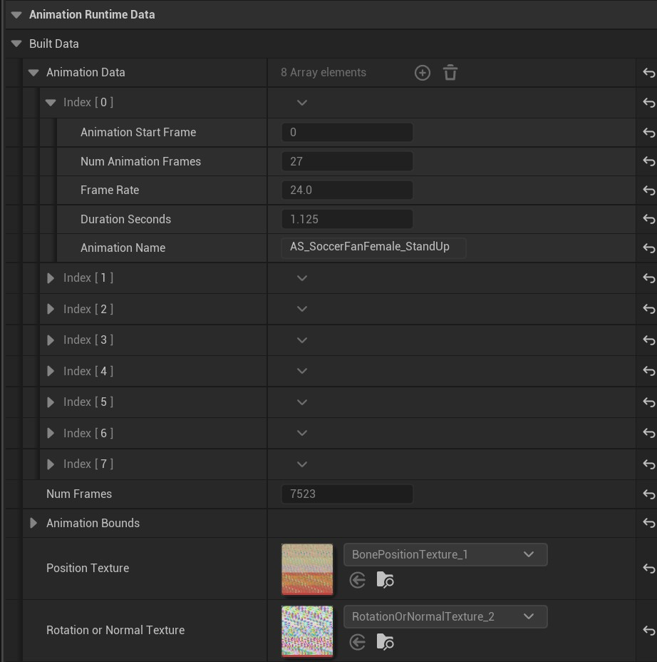
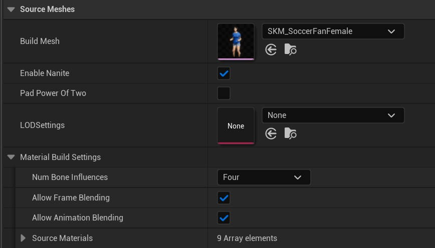

# VA Asset Editor

## Interface Overview

The VA Asset Editor window contains several key elements that help you manage and customize your vertex animation data:

{style="margin-top: 10px; margin-bottom: 5px;"}

### 1. Rebuild Asset Button
This button reconstructs your mesh and materials. Use this after making any adjustments in the details panel to ensure your changes are properly applied.

### 2. Preview Mesh Selection
For Bone VA Asset Collections that contain multiple meshes, this dropdown menu allows you to switch between different meshes in the preview window. This is particularly useful when working with collections that include variations of the same character or object.

### 3. Reapply Custom Data
This feature enables you to inject custom float data into your instanced VA mesh. By modifying these values, you can create visual variations between instances, ensuring each character or object appears unique in your scene.

### 4. Details Panel
The right-side panel contains crucial settings divided into several categories:

- Mesh Build Settings
- Animation Data Settings
- Mesh Runtime Data Settings
- Asset Validation
- Animation Build Settings

These settings allow you to fine-tune various aspects of your vertex animation. (Detailed information about each category will be covered in later sections)

### 5. Animation Preview
The timeline area displays your currently selected preview animation. You can switch between different animations to visualize how your asset will appear in-game.

### 6. Animation Timeline
The bottom panel provides standard timeline controls for previewing your animations. Use these controls to play, pause, and scrub through your animation sequences.

## Details Panel Settings

### Animation Build Settings
{width=600px style="margin-top: 10px; margin-bottom: 5px;"}

The Animation Build Settings panel lets you manage your animation sequences and build options. Here you can edit the source animation list. Additional settings include options for texture generation quality and power-of-two padding optimization.

> **Note:** Remember to click the Rebuild Asset button after making changes.

### Animation Runtime Data
{width=600px style="margin-top: 10px; margin-bottom: 5px;"}

This section shows the read-only compiled animation data for each sequence, including:

- Animation frame details (start frame, duration, frame rate)
- Total frame count
- Animation Bounds
- Position and rotation/normal texture mappings

### Mesh Build Settings
{width=600px style="margin-top: 10px; margin-bottom: 5px;"}

The Mesh Build Settings control how your mesh assets are processed, featuring:

- Source mesh selection and configuration
- LOD and Nanite compatibility options
- Material build settings with bone influence controls
- Animation and frame blending options
- The source materials list

> **Note:** Remember to click the Rebuild Asset button after making changes.

### Mesh Runtime Data
{width=600px style="margin-top: 10px; margin-bottom: 5px;"}

This panel displays runtime mesh properties and allows configuration of:

- Mesh statistics (vertex count, bones, UV channels)
- Material assignments and references
- Custom float parameter ranges for runtime modification

#### Per Instance Custom Data
A powerful feature that enables dynamic material variation across instances. Each custom data entry consists of:

- **Custom Data Name**: A unique identifier used to reference this parameter in your materials
- **Custom Float Range**: Minimum and maximum values for the parameter
- **Round Values to Int**: Option to round the generated values to whole numbers

The Per Instance Custom Data system allows you to inject randomized or controlled float values into your instanced materials. This creates visual diversity across instances without the need for multiple materials or meshes. For example:

- Create color variations by connecting the float value to material color parameters
- Adjust material properties like roughness or metallic values per instance
- Control texture tiling or blending between different textures
- Implement any other material parameter variations you can imagine

When the instance is spawned, each custom float parameter will generate a value within its specified range. These values can then be accessed within your material graphs to create unique variations for each instance.

> **Note:** Remember to click the Rebuild Asset button after making changes.
