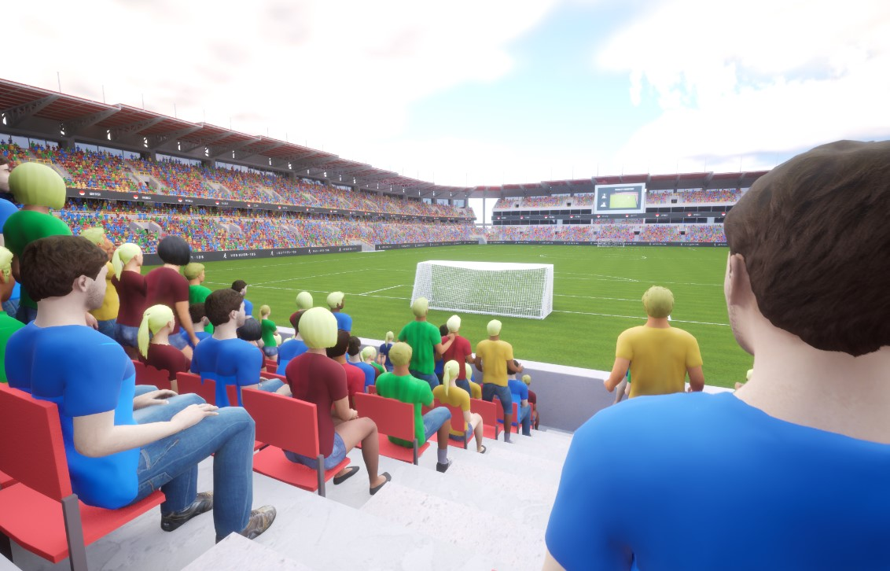

# VA Animation Lists

VA Animation Lists organize and manage animation behaviors for vertex-animated meshes, providing a structured way to control animation playback and transitions.

## Overview

Animation Lists serve as containers for Animation Logic instances, which define how animations should play and transition. They provide:

- Organization of related animations into logical groups
- Management of animation state transitions
- Control of playback for multiple instances
- Blueprint-accessible animation sequencing

## Setup

1. In your VA Component details panel, find the "Animation Lists" section
2. Click the "+" button to add a new Animation List
3. Select an Animation Logic class (e.g., Sequence, Random, State Machine)
4. Configure the default values for the selected logic type
5. Add animations to the list from your VA Asset Collection

{: style="display: block; margin: 0 auto; width: 70%; padding: 10px;"}

## Common Animation List Types

### Sequence Lists
Play animations in a specific order, useful for:
- Walk cycles with multiple animations
- Multi-part idle animations
- Scripted sequences of actions

### Random Lists
Randomly select animations from a pool, ideal for:
- Varied idle behaviors
- Background character diversity
- Environmental animations

### State Machine Lists
Control animations based on states and transitions, perfect for:
- Character behavior based on conditions
- Complex animation systems with multiple states
- Interactive elements

## Blueprint Interface

### List Management
```cpp
// Create new animation list
CreateAnimationList(LogicTemplate)

// Remove animation list
RemoveAnimationList(Index)

// Access lists
GetAnimationList(Index)
```

### Component Integration
```cpp
// Set owning component
SetOwningComponent(Component)

// Get owning component 
GetOwningComponent()
```

### Playback Control
```cpp
// Play a specific animation list
PlayAnimationList(ListIndex)

// Stop a specific animation list
StopAnimationList(ListIndex)
```

## See Also

- [Workflow Overview](workflow-overview.md) - Understand how Animation Lists fit into the overall process
- [VA Animation Player](va-animation-player.md) - Control animations through the Animation Player
- [VA Animation Logic](animation-logic.md) - Define custom animation behaviors
- [VA Mesh Component](vertex-anim-mesh-component.md) - Use Animation Lists with single characters
- [VA Instanced Mesh Component](vertex-anim-instanced-mesh-component.md) - Use Animation Lists with multiple characters
