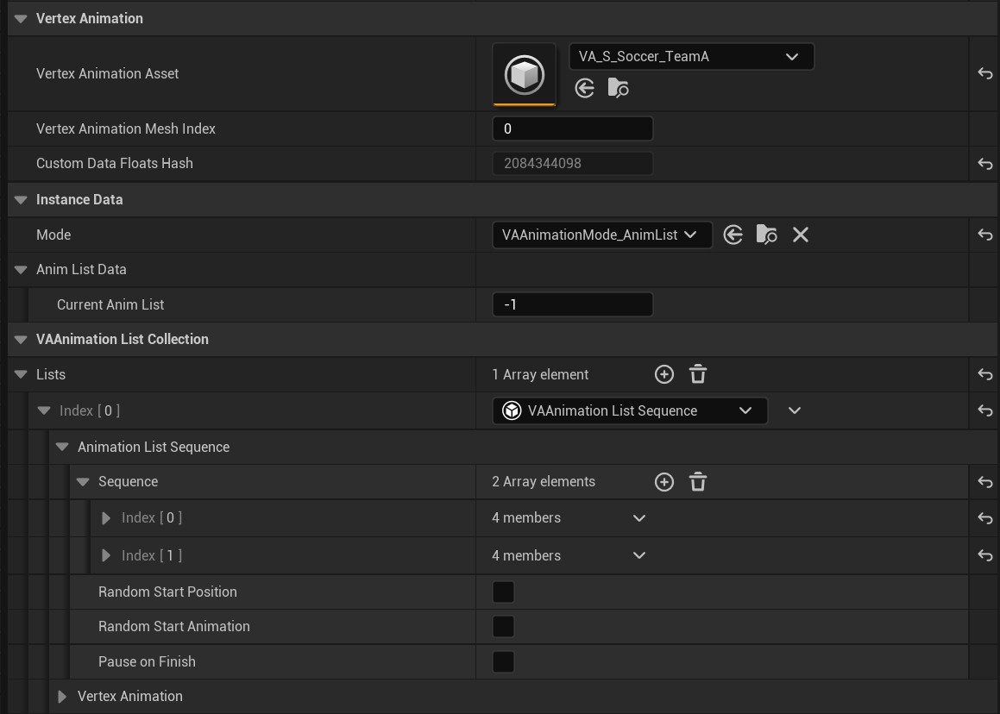

# UVAMeshComponent

A component that allows playback of a single instance of a VA Asset Collection. Perfect for hero characters or any situation where you need precise control over a single animated mesh, rather than managing multiple instances with the VA Instanced Mesh Component.

The VA Mesh Component inherits from UStaticMeshComponent and uses a modular architecture with separate sub-components for different functionalities.

{width=600px style="margin-top: 10px; margin-bottom: 5px;"}

## Core Properties

### Asset Reference
> - **Vertex Animation Asset**: Select your VA Asset Collection containing the mesh and animation data
> - **Vertex Animation Mesh Index**: Select which mesh to use from the asset collection (if it contains multiple meshes)
> - **Custom Data Floats Hash**: Read-only property showing the hash of custom data configurations

## Sub-Components Architecture

> The VA Mesh Component uses a modular design with specialized sub-components:
>
> - **Animation Lists Collection**: Manages multiple animation lists
> - **Animation Mode Manager**: Controls how animations are played (single vs. list mode)
> - **Instance Data Stores**: Manage both persistent and runtime-only animation data

## Animation Modes

### Single Animation Mode
> Play individual animations directly from the VA Asset Collection. Use this mode when you need precise control over specific animations.

### Animation List Mode  
> Play animations through Animation Lists that define playback behavior. Animation Lists can be:
>
> - **Sequential**: Play animations in order
> - **Random**: Play animations randomly from the list
> - **Custom Logic**: Use custom animation list implementations

## Animation Lists

> Animation Lists are now `UVAAnimationList` objects that contain:
>
> - **Animation References**: List of animations from the VA Asset Collection
> - **Logic Data**: Settings that control playback behavior
> - **Playback Rules**: How animations transition and repeat

## Animation Control Functions

> Key Blueprint-callable functions for controlling animations:
>
> - **Play Single Animation**: Play a specific animation from the asset collection
> - **Play Animation List**: Start playback using an animation list
> - **Set Animation Asset**: Change the VA Asset Collection at runtime
> - **Set Animation Mesh Index**: Switch between meshes in multi-mesh collections
> - **Set Animation Mode**: Toggle between single and list animation modes

> These functions are provided by the Animation Mode Manager and Animation Lists systems.

## See Also

- [Workflow Overview](workflow-overview.md) - Understand how components fit into the overall process
- [VA Instanced Mesh Component](vertex-anim-instanced-mesh-component.md) - For managing multiple instances
- [Animation Control](animation-control.md) - Control animations with Single and AnimList modes
- [Custom Animation Lists](custom-animation-lists.md) - Create custom animation behaviors
- [VA Asset Collection](va-asset-collection.md) - The asset type used by this component
