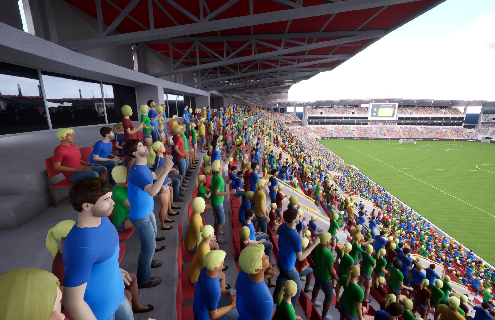

# Workflow Overview

This page provides a comprehensive overview of the Vertex Animation Toolset workflow, helping you understand how the different components work together to create efficient animated characters.

## The Complete Workflow

{: style="display: block; margin: 0 auto; width: 85%; padding: 10px;"}

The Vertex Animation Toolset workflow consists of several key stages:

## 1. Asset Creation

> The first step is to convert your skeletal mesh animations into vertex animations:
>
> 1. Right-click on your skeletal mesh in the content browser
> 2. Choose either "Make Bone Animation" or "Make Vertex Animation"
> 3. Select the animations you want to include
> 4. Create and save your VA Asset Collection
>
> For detailed instructions, see the [Quick Start Guide](quick-start.md).

## 2. Asset Configuration

> Once your VA Asset Collection is created, you can configure it using the VA Asset Editor:
>
> - Adjust animation build settings
> - Configure mesh properties
> - Set up custom data for instance variations
> - Rebuild the asset after making changes
>
> For more information, see [VA Asset Collection](va-asset-collection.md) and [VA Asset Editor](va-asset-editor.md).

## 3. Implementation Options

> The Vertex Animation Toolset offers two main implementation paths:
>
> ## Single Character Implementation:
>
> For individual characters that need precise control:
>
> - Use the [VA Mesh Component](vertex-anim-mesh-component.md)
> - Configure animation lists and logic
> - Control animations through the VA Animation Player
>
> ## Multiple Characters/Crowds Implementation:
>
> For efficiently rendering multiple characters:
>
> - Use the [VA Instanced Mesh Component](vertex-anim-instanced-mesh-component.md)
> - Manage instances through code or the Crowd Tools
> - Control batch animations through the VA Animation Player

## 4. Crowd Management

> For scenes with multiple characters, the Crowd Tools provide intuitive ways to place and manage instances:
>
> - [Crowd Editor Mode](crowd-tools-editor-mode.md) for overall management
> - [Crowd Brushes](crowd-brushes.md) for configuring instance properties
> - Multiple placement methods:
>  - [Paint Tool](crowd-tools-paint.md) for free-form placement
>  - [Grid Tool](crowd-tools-grid.md) for structured placement
>  - [Single Placement](crowd-tools-single.md) for precise individual placement

## 5. Animation Control

> Control your vertex animations through:
>
> - [VA Animation Player](va-animation-player.md) for playback control
> - [VA Lists](vertex-anim-lists.md) for organizing animations
> - [Animation Logic](animation-logic.md) for defining animation behaviors

## Decision Guide

### When to use Bone vs. Vertex Animation

| Bone Animation | Vertex Animation |
|----------------|------------------|
| ✓ Enables animation sharing between meshes | ✓ More performant |
| ✓ Supports more animations and vertices | ✓ Lower material costs |
| ✗ Not as performant as Vertex Animation | ✗ Doesn't support animation sharing |
| Best for: Projects with many shared animations | Best for: Maximum performance in crowds |

### When to use VA Mesh vs. VA Instanced Mesh Component

| VA Mesh Component | VA Instanced Mesh Component |
|-------------------|----------------------------|
| ✓ Individual control over a single character | ✓ Efficient rendering of multiple characters |
| ✓ More detailed control options | ✓ Better performance for crowds |
| ✗ Not optimized for multiple instances | ✗ Less individual control over each instance |
| Best for: Hero characters, important NPCs | Best for: Background characters, crowds |

## Next Steps

- Follow the [Quick Start Guide](quick-start.md) to create your first VA Asset Collection
- Learn about [VA Asset Collection](va-asset-collection.md) to understand the core asset structure
- Explore the [Crowd Tools](crowd-tools-editor-mode.md) to start placing characters in your scene
